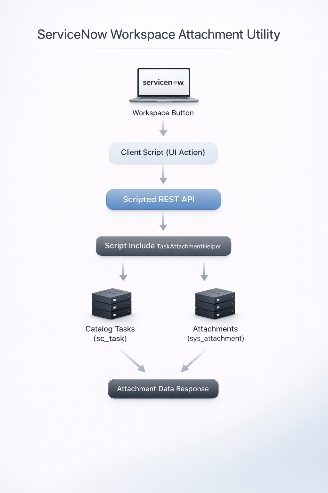

# SN-workspace-utility
Workspace solution to view attachments from Catalog Tasks associated with a Requested Item

# ServiceNow Workspace – View Task Attachments
In ServiceNow Workspace there is no easy way to view attachments
from Catalog Tasks directly from the Requested Item.

This utility provides a Workspace button that displays those
attachments in a modal.

## Overview
This solution allows users to view attachments from Catalog Tasks associated with a Requested Item directly in Workspace.

## Components

Script Include  
TaskAttachmentHelper
Scripted REST API
Workspace Declarative Action  
View Attachment button

## Architecture

## Version
Tested on ServiceNow Zurich
